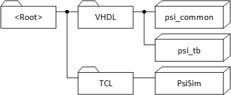

---
# Introduction
---
## 1.1 Working Copy Structure
If you just want to use some components out of the *psi\_common*
library, no special structure is required and the repository can be used
standalone.

If you want to also run simulations and/or modify the library,
additional repositories are required (available from the same source as
*psi\_common*) and they must be checked out into the folder structure
shown in the figure below since the repositories reference each-other
relatively.

It is not necessary but recommended to use the name *psi\_lib* as name
for the *\<Root\>* folder.

 Figure 1: Working copy structure 

